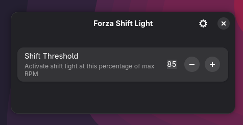

# Forza Shift Light (WLED)

Simple RPM shift light for Forza Horizon / Motorsport using UDP telemetry + WLED.

The app listens to game telemetry and lights up configurable LED zones when RPM reaches a defined threshold.

Built with Python + GTK4 + Libadwaita.



---

## Features

- Linux native GTK4 interface
- Multiple WLED device support
- Configurable LED zones
- Real-time settings adjustment

---

## Requirements

- Linux
- Python 3.10+
- GTK4
- Libadwaita
- WLED with UDP Realtime enabled

---

## Installing Dependencies

### Arch Linux

```bash
sudo pacman -S python python-gobject gtk4 libadwaita
```
